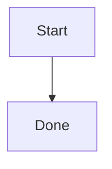

# md
terminal markdown rendered

`md` opens its built-in pager when stdout is a terminal. When output is piped
or redirected, it renders once and writes the result to stdout. Use `-P` to
force pager mode.

Fenced `mermaid` blocks render as Unicode box-drawing diagrams:

````markdown

````

The exact Grok Mermaid renderer is embedded as WebAssembly and currently uses
Node.js as its runtime host.
